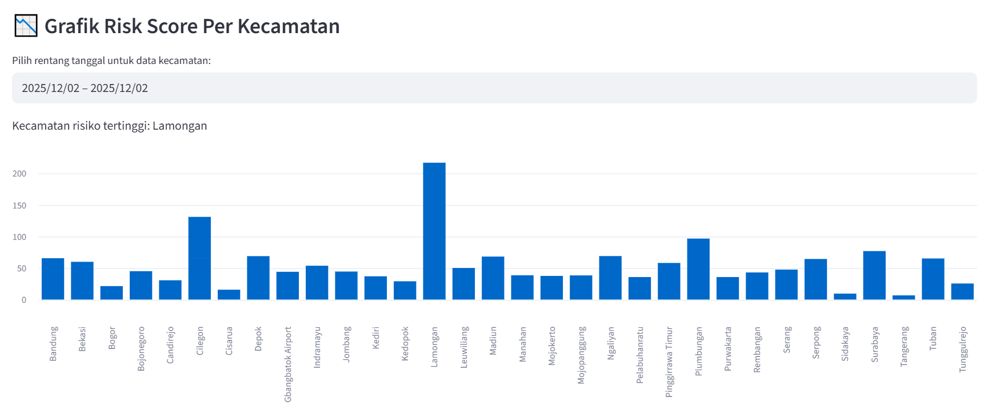
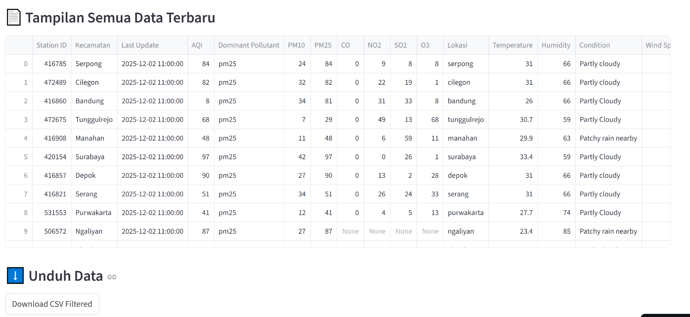

## Profile
Program Studi       : Teknik Komputer
Matakuliah          : Pemrosesan dan Infrastruktur Data 
Anggota Kelompok 4  :
- SAVINA LARISSA ANJANI		    (NIM 235150300111027)
- NABILLA SUCI AMANDA		    (NIM 235150301111044)
- NADYA QANITA NABILA		    (NIM 235150307111008)
- NISRINA INDRIANI JATMIKO		(NIM 235150307111022)

Tahun Ajaran : 2025/Ganjil

=======================================================

## Cara makai:
1) 'docker-compose up --build'

2) Cek port mongodb --> localhost:8081

3) Jalankan 'store_data.py'
    - data-data akan kesimpan di folder data

4) Pada port 8081, seharusnya semua data sudah terkirim
    - ada 4 collection : data_waqi, data_weatherAPI, data_risk_score, dan data_combine

5) Pada streamlit (setelah di-push ke github sendiri), upload aplikasi ini
    - hasil dashboard projek kami bisa dilihat di https://air-quality-risk-kel4.streamlit.app/

=======================================================

## Hasil Dashboard (streamlit)
link https://air-quality-risk-kel4.streamlit.app/

